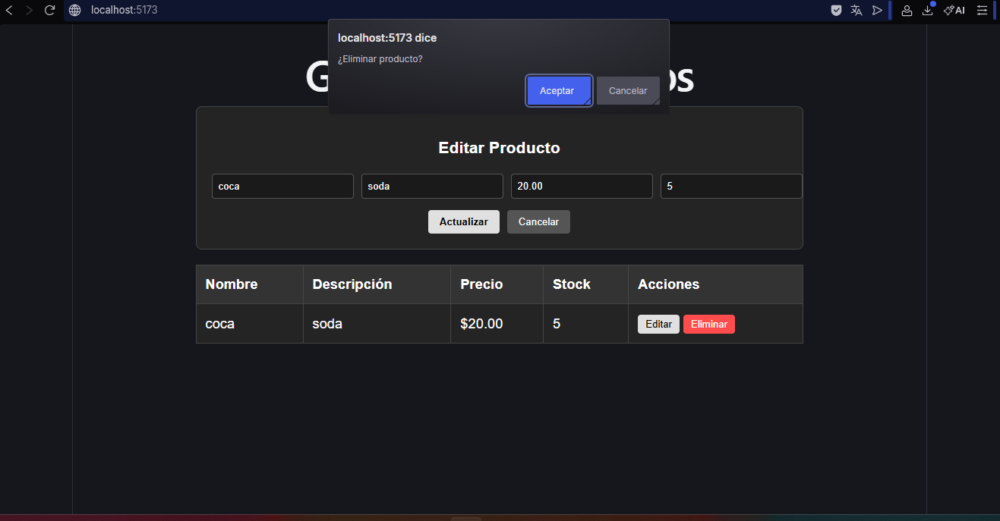
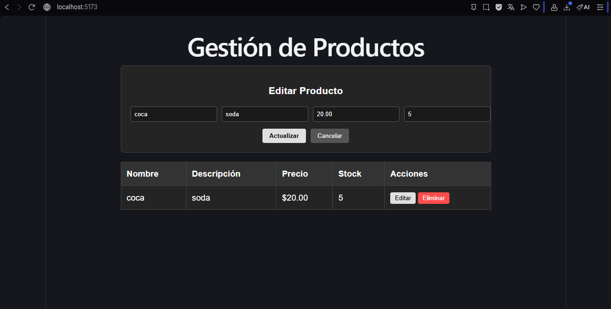
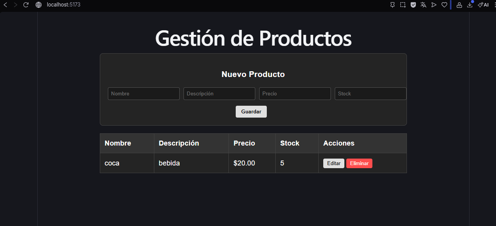

# CRUD de Gestión de Productos - Examen Diagnóstico

## Descripción
Este es un sistema completo de gestión de productos (CRUD) que permite crear, leer, actualizar y eliminar registros de una base de datos. El proyecto fue desarrollado para demostrar habilidades de integración entre un backend robusto y un frontend dinámico.

## Tecnologías Utilizadas
- **Backend:** Python con Django REST Framework.
- **Frontend:** React.js con Vite.
- **Base de Datos:** MySQL.
- **Comunicación:** Axios para peticiones HTTP.
- **Estilos:** CSS.

## Funcionalidades
- Listado de productos en tiempo real.
- Formulario reactivo para alta y edición.
- Eliminación de registros con confirmación.
- Arquitectura de servicios en el frontend.
- Conexión a base de datos relacional.

## Instrucciones para ejecutar el proyecto

### Backend (Django)
1. Navega a la carpeta `Diagnostico-Crud`.
2. Activa el entorno virtual: `venv\Scripts\activate`.
3. Inicia el servidor: `python manage.py runserver`.

### Frontend (React)
1. Navega a la carpeta `front-crud`.
2. Instala las dependencias: `npm install`.
3. Inicia el proyecto: `npm run dev`.

## Evidencias
  
## Uso de IA
**¿Se utilizó IA?:** Sí.
**¿Para qué?:** Se utilizó como asistente del frontend y solucionar errores del backend